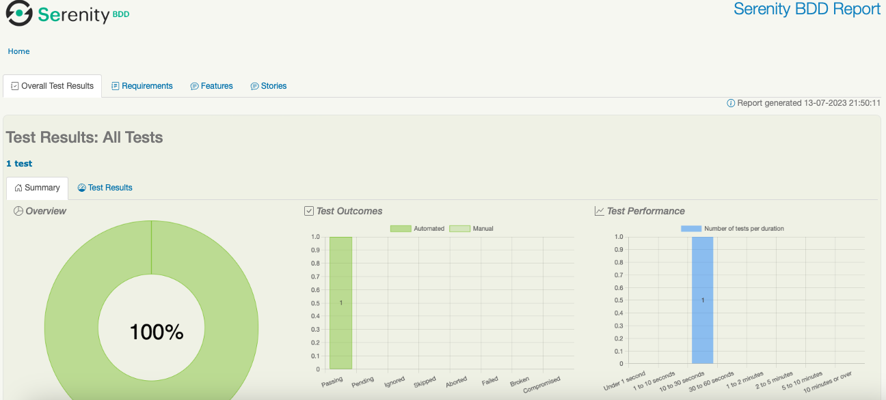
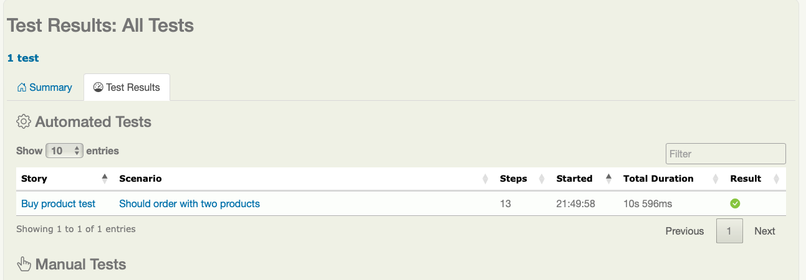
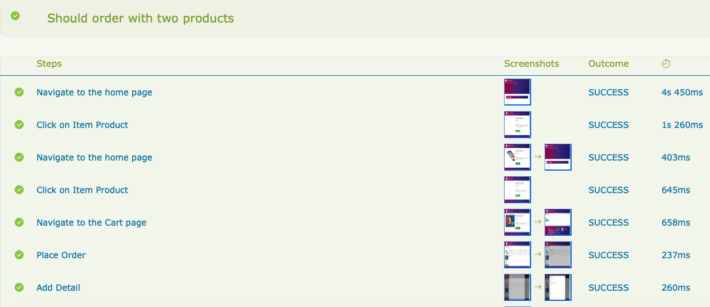
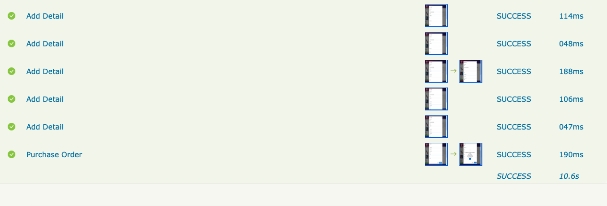

# Serenity BDD Challenge QA

This project was developed on a Mac but can be run on any device that contains it:

- JDK version 11.0
- Serenity 3.5
- Maven version 3.9.3
- IntelliJ IDE version 2023

## Use Maven to run test

Open a command window and run:

    mvn clean verify

## Viewing the reports

The command provided above will produce a Serenity test report in the `target/site/serenity` directory. Go take a look!

Findings and Conclusions

When performing the test flow when you wanted to add a product to the cart and then evaluated that the cart total is the sum of the selected products, it was found on some occasions that the test failed, ie the expected sum was not the correct total sum, this was because they were not selecting the total correctly from the page as it was prevented by a confrmacikón alert that is displayed on the page when you add a product. 

This test that sometimes runs and sometimes fails is known as flakyTest, this flaw was improved by capturing the alert and waiting for all the components to be rendered correctly before extracting the data. 

This project tries to follow a design pattern known as Screenplay where there are actors that perform actions and tasks, it can be improved to better adhere to the structure.

